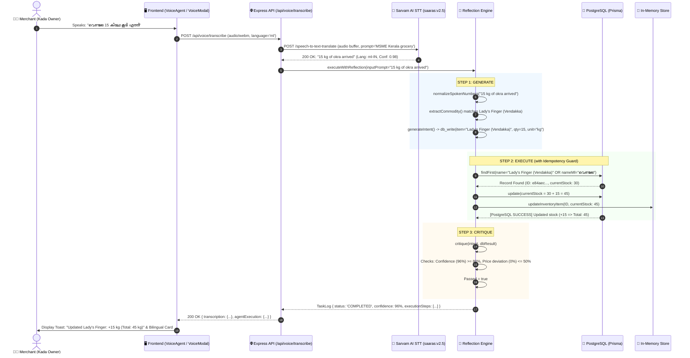
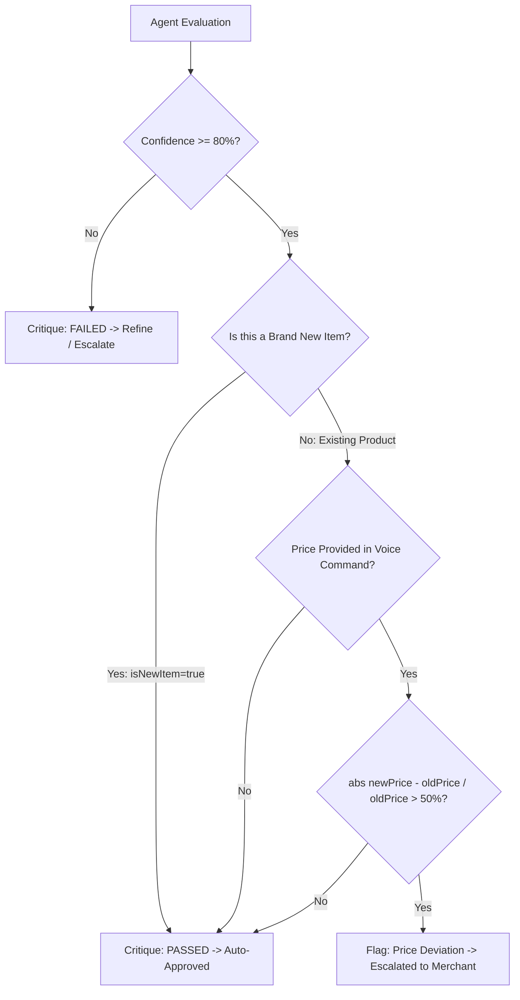

# 🎙️ Vernacular Voice-to-Stock Architecture & Workflow

> **Repository:** `Empowering-Local-Enterprise-The-Vernacular-Agentic-MSME-Assistant`  
> **Module:** Voice Capture &rarr; Sarvam STT &rarr; Reflection Engine &rarr; Database Sync &rarr; Merchant Triage  
> **Target Audience:** Engineering, Product, System Operators

---

## 1. Executive Summary

The **Voice-to-Stock** subsystem enables local Kerala MSME merchants to manage inventory effortlessly using natural spoken language—spanning **Malayalam (മലയാളം)**, **Manglish (Malayalam written in Latin script)**, and **English**. 

Instead of typing into traditional ERP tables, a shopkeeper records a voice note (e.g., *"വെണ്ടക്ക 15 കിലോ കൂടി എത്തി ₹30 രൂപ"* or *"Add 10 kg okra"*). The assistant:
1. Translates vernacular audio directly into normalized English text via **Sarvam AI STT Translate**.
2. Evaluates the command through an autonomous **Agentic Reflection Engine** (*Generate &rarr; Execute &rarr; Critique &rarr; Refine*).
3. Distinguishes between **creating a new catalog item** versus **incrementing existing inventory** using 2-stage discriminative matching.
4. Enforces strict **idempotency guards** and **price safety guardrails** (detecting abnormal price deviations).
5. Updates **PostgreSQL** and updates the live merchant dashboard with bilingual feedback.

---

## 2. End-to-End Workflow Architecture

```mermaid
flowchart TD
    subgraph Client ["1. Frontend Web Client (React + Vite)"]
        A[Merchant Speaks into Microphone] -->|MediaRecorder API| B[Audio Blob: audio/webm]
        B -->|POST /api/voice/transcribe| C[Multipart Dispatch]
    end

    subgraph AudioEngine ["2. Speech-to-Text-Translate Layer"]
        C --> D{Sarvam API Configured?}
        D -->|Yes| E["Sarvam AI STT Translate API (saaras:v2.5)"]
        D -->|Fallback| F["Mock Vernacular Presets / Whisper"]
        E -->|Translated Text + Confidence + Lang| G[Normalized English Transcript]
    end

    subgraph AgentEngine ["3. Agentic Reflection Engine"]
        G --> H["Sarvam AI LLM (sarvam-105b) Intent Extraction"]
        H -->|Fallback if Offline| I["COMMODITY_CATALOG + normalizeSpokenNumbers()"]
        H --> J["generateIntent() -> db_write Tool Intent"]
        I --> J
        J --> K{"First Attempt Mutation?"}
        K -->|Attempt 0| L["agentTools.db_write()"]
        K -->|Attempt >0| M["Return Cached Result (Idempotency Guard)"]
        
        L --> N["tools.ts / PostgreSQL Resolver"]
    end

    subgraph Persistence ["4. Database & Discrimination Layer"]
        N --> O["resolveOrCreateBusiness()"]
        O --> P{"Exact Match on name / nameMl?"}
        P -->|Yes| Q["Item Exists: Update Stock (+Qty)"]
        P -->|No| R{"Discriminative Variety Match?"}
        R -->|Conflict Detected| S["Create Distinct Variety"]
        R -->|Match Found| Q
        R -->|No Match| T["Create Brand New Inventory Item"]
        
        Q --> U["PostgreSQL COMMIT & Store Sync"]
        T --> U
    end

    subgraph ReflectionCritique ["5. Critique & Quality Evaluation"]
        U --> V["critique() Evaluation"]
        V --> W{"isNewItem?"}
        W -->|Yes| X["Pass Price Guardrail (No History)"]
        W -->|No| Y{"Price Deviation > 50%?"}
        Y -->|Yes| Z["Trigger Alert: Price Fluctuation"]
        Y -->|No| AA["Critique: PASSED"]
        X --> AA
        
        AA --> AB{"Confidence >= 80%?"}
        AB -->|Yes| AC["Status: COMPLETED (Auto-Approved)"]
        AB -->|No & Retries < 3| AD["Refine Intent & Retry"]
        AB -->|No & Retries >= 3| AE["Status: NEEDS_TRIAGE (Human Review)"]
    end

    subgraph UIOutput ["6. Live Merchant Dashboard"]
        AC --> AF[Updated Stock Badge & Bilingual Audio TTS / Toast]
        AE --> AG[Merchant Review Drawer '! Needs Attention']
    end
```



---

## 3. Sequence Diagram (Full Lifecycle)



---

## 4. Architectural Deep Dive: Subsystem by Subsystem

### 4.1 Frontend Audio Capture Layer
- **Source:** `frontend/src/components/VoiceAgent.tsx` and `frontend/src/components/VoiceModal.tsx`
- Uses the standard HTML5 `MediaRecorder` API.
- Captures audio in chunks at `16kHz / 44.1kHz` as `audio/webm;codecs=opus` or `audio/wav`.
- Includes real-time frequency analysis (`AnalyserNode`) providing visual waveform feedback.
- Dispatches a multipart `FormData` request containing `audio` file blob and optional context parameters (`prompt`, `language`).

### 4.2 Sarvam AI Vernacular Speech-to-Text-Translate Engine
- **Source:** `backend/src/voice/sarvamStt.ts`
- **Endpoint:** `POST https://api.sarvam.ai/speech-to-text-translate`
- **Model:** `saaras:v2.5`
- **Why STT-Translate over Standard STT?**
  Local merchants speak fluid mixes of Malayalam, Manglish, Tamil, and English. Standard STT produces mixed-script transcripts with spelling variations. Sarvam's `speech-to-text-translate` takes raw audio and returns **semantically clean English text** while returning the detected native language code (`ml-IN`) and probability score.
- **Payload Structure:**
  ```typescript
  const formData = new FormData();
  formData.append('file', new Blob([audioBuffer], { type: mimeType }), filename);
  formData.append('model', 'saaras:v2.5');
  formData.append('prompt', 'MSME grocery store inventory stock and billing in Kerala. Spoken in Malayalam or Manglish.');
  ```

### 4.3 Agentic Reflection Engine (Generate &rarr; Execute &rarr; Critique &rarr; Refine)
- **Source:** `backend/src/agent/reflectionEngine.ts`
- Operates on a strict finite state machine:
  `Idle → Input Received → Generate → Execute → Critique → Completed / Refine / Human Triage`

#### A. Vernacular Number Normalization (`normalizeSpokenNumbers`)
Spoken Malayalam numbers are converted to digits before regex execution:
```typescript
const numberMap: [RegExp, string][] = [
  [/(?:\b(hundred|nooru)\b|നൂറ്)/gi, '100'],
  [/(?:\b(fifty|ambathu)\b|അമ്പത്)/gi, '50'],
  [/(?:\b(thirty|muppathu)\b|മുപ്പത്)/gi, '30'],
  [/(?:\b(ten|pathu)\b|പത്ത്)/gi, '10'],
  // ... comprehensive Malayalam numerals 1-100
];
```

#### B. The Unicode Word-Boundary Architecture (`vernacularPattern`)
> **JavaScript Regex Gotcha Solved:**  
> In JavaScript, the `\b` word boundary token **only operates on ASCII `\w` (`[a-zA-Z0-9_]`)**. All Malayalam Unicode characters (U+0D00 to U+0D7F) are considered `\W`. Wrapping Malayalam words inside `\b(word|മലയാളം)\b` causes matching to fail silently when preceded or succeeded by spaces or punctuation!  
>  
> The system implements a hybrid pattern constructor:
> ```typescript
> function vernacularPattern(latinPhrases: string, mlPhrases?: string): RegExp {
>   if (!mlPhrases) return new RegExp(`\\b(${latinPhrases})\\b`, 'i');
>   // Latin/Manglish uses ASCII \b to prevent partial matches (e.g. 'oil' inside 'boil')
>   // Malayalam script matches directly without ASCII word boundary constraints
>   return new RegExp(`(?:\\b(${latinPhrases})\\b|(${mlPhrases}))`, 'i');
> }
> ```

#### C. Specificity-First Commodity Catalog (`COMMODITY_CATALOG`)
The catalog is strictly ordered from **most specific** to **generic fallbacks**:
1. Specific Rice Varieties: `Basmati Rice`, `Palakkadan Matta Rice`, `Jeerakasala Biryani Rice`, `Sona Masoori Rice`, `Ponni Rice`.
2. Generic Rice: `Local White Rice (അരി)`.
3. Specific Vegetables: `Lady's Finger (Vendakka)`, `Sambar Small Onion`, `Fresh Country Tomato`.
4. Generic Grains / Oils.

#### D. Dynamic NLP Cleansing Fallback
For uncataloged items, dynamic NLP captures the product name while stripping quantity words, units, and prepositions (`kilos`, `kg`, `into`, `to`, `add`, `stock`, `of`) so names like *"Kilos Okra"* or *"Okra Into 30 Kg"* are prevented at the root.

---

### 4.4 Database Execution & Discrimination Layer
- **Source:** `backend/src/agent/tools.ts`
- **Database:** PostgreSQL via Prisma ORM (`InventoryItem` model)

#### A. 2-Stage Discriminative Matching
When an item name arrives (e.g. `"Lady's Finger (Vendakka)"`), the database engine prevents collisions through two stages:
1. **Stage 1 (Exact Match):** Case-insensitive match on either English `name` or Malayalam `nameMl`.
2. **Stage 2 (Variety Qualifier Discrimination):** If an exact match is not found, fuzzy substring matching is performed **only if variety qualifiers match**:
   ```typescript
   const varietyQualifiers = [
     'basmati', 'jeerakasala', 'matta', 'ponni', 'sona masoori', 'pachari',
     'coconut', 'sunflower', 'mustard', 'sesame',
     'black', 'green', 'white', 'red',
     'powder', 'seeds', 'whole', 'flour', 'atta', 'maida'
   ];
   ```
   If a merchant has *"Basmati Rice"* and says *"Matta Rice"*, the qualifier check prevents Matta from mutating the Basmati record!

#### B. Update vs. Create Decision Tree
```typescript
if (dbExisting) {
  // INCREMENT EXISTING STOCK
  const newDbStock = dbExisting.currentStock + validated.quantity;
  await prisma.inventoryItem.update({
    where: { id: dbExisting.id },
    data: {
      currentStock: newDbStock,
      unitPrice: validated.pricePerUnit || dbExisting.unitPrice
    }
  });
  dbStatus.action = 'updated';
} else {
  // CREATE NEW INVENTORY RECORD
  const created = await prisma.inventoryItem.create({
    data: {
      name: validated.productName,
      nameMl: validated.productNameMl,
      category: validated.category,
      currentStock: validated.quantity,
      unit: validated.unit || 'kg',
      unitPrice: validated.pricePerUnit || 50
    }
  });
  dbStatus.action = 'created';
}
```

#### C. The Idempotency Mutation Guard (`hasExecutedDbMutation`)
> **Ghost Stock Multiplication Prevented:**  
> When the Agentic Reflection Engine loops through critique attempts (up to 3 retries), a naive execution model would call `db_write` 3 separate times, tripling stock!  
>  
> The engine implements an idempotency guard in `reflectionEngine.ts`:
> ```typescript
> if (intent.tool === 'db_write') {
>   if (!hasExecutedDbMutation) {
>     dbResult = await agentTools.db_write(intent.params);
>     cachedDbResult = dbResult;
>     hasExecutedDbMutation = true; // Lock execution
>   } else {
>     dbResult = cachedDbResult!; // Reuse previous result on retry
>   }
> }
> ```

---

### 4.5 Safety Critique & Guardrails

The `critique()` method evaluates every execution against two strict safety metrics:



1. **Confidence Threshold:** If transcription confidence is $<80\%$, the task is flagged for merchant review (`needsReview = true`).
2. **Price Deviation Guardrail:**  
   If an existing item was recorded at ₹30/kg, and a spoken note specifies ₹200/kg (deviation $>50\%$), the engine refuses autonomous completion and escalates to the merchant triage drawer (`! Needs attention`) to protect against accidental financial losses.
3. **New Item Bypass:**  
   New items have no prior pricing history. The engine checks `dbStatus.action === 'created'` to bypass price deviation checks on brand new items.

---

## 5. Concrete Execution Scenarios

### Scenario A: Adding an Existing Item (Okra) via Malayalam
```
User Spoken: "വെണ്ടക്ക 15 കിലോ കൂടി എത്തി"
1. Sarvam STT: "15 kg of okra arrived" (Confidence: 0.98, Lang: ml-IN)
2. Normalizer: "15 kg of okra arrived"
3. Commodity Extraction: Matched Lady's Finger (Vendakka)
4. Intent: db_write { productName: "Lady's Finger (Vendakka)", quantity: 15, unit: "kg" }
5. PostgreSQL Match: ID e84aec... found (currentStock: 30)
6. Mutation: currentStock updated 30 + 15 => 45 kg
7. Critique: Confidence 98% >= 80%, No price conflict => PASSED
8. Result: Status COMPLETED, "+15 kg Lady's Finger added"
```

### Scenario B: Adding a Specific Rice Variety via English
```
User Spoken: "Received 50 kg of Jeerakasala Biryani Rice at 32 rupees per kilo"
1. Sarvam STT: "Received 50 kg of Jeerakasala Biryani Rice at 32 rupees per kilo"
2. Commodity Extraction: Matched Jeerakasala Biryani Rice (Specific Rice Variety)
3. Intent: db_write { productName: "Jeerakasala Biryani Rice", quantity: 50, unit: "kg", pricePerUnit: 32 }
4. Discriminative Match: Confirms variety is Jeerakasala (not Basmati or Matta)
5. Mutation: Increments stock (+50 kg) and sets unitPrice to ₹32
6. Critique: PASSED
```

### Scenario C: Abnormal Price Anomaly Triggering Merchant Triage
```
User Spoken: "Add 10 kg okra at 500 rupees per kilo"
1. Commodity Extraction: Lady's Finger (Vendakka) (Previous unit price: ₹30)
2. Intent: db_write { productName: "Lady's Finger (Vendakka)", quantity: 10, pricePerUnit: 500 }
3. Critique Evaluation:
   - Price Deviation: |500 - 30| / 30 = 1566% > 50%
   - Result: Critique FAILS with reason: "Price anomaly detected: ₹500 vs previous ₹30"
4. Escalation: Status set to NEEDS_TRIAGE
5. Merchant UI: Highlights badge "! Needs Attention" with manual Confirm/Reject modal
```

---

## 6. API Reference & Data Contracts

### 6.1 `POST /api/voice/transcribe`
Dispatches voice audio for transcription and optional autonomous reflection.

#### Request Headers:
`Content-Type: multipart/form-data`

#### Request Fields:
| Field | Type | Description |
| :--- | :--- | :--- |
| `audio` | `File` (Binary) | Audio recording (`audio/webm`, `audio/wav`, `audio/mp4`) |
| `language` | `string` | Spoken language hint (`ml`, `en`, default: `ml`) |
| `prompt` | `string` (Optional) | Context prompt for Sarvam STT engine |
| `autoExecute` | `boolean` (Default: `true`) | Pipe directly into Agentic Reflection Engine |

#### Response (`200 OK`):
```json
{
  "transcription": {
    "success": true,
    "engine": "Sarvam AI (saaras:v2.5 speech-to-text-translate)",
    "language": "ml-IN",
    "transcript": "15 kg of okra arrived",
    "transcriptMl": "വെണ്ടക്ക 15 കിലോ കൂടി എത്തി",
    "confidence": 98.2,
    "durationSeconds": 3.4,
    "requestId": "20261008_7f9a0f77-...",
    "needsReview": false,
    "reviewReason": null
  },
  "agentExecution": {
    "taskLog": {
      "id": "task_173...",
      "taskType": "stock_update",
      "status": "COMPLETED",
      "summary": "Updated Lady's Finger (Vendakka): +15 kg (Total: 45 kg).",
      "summaryMl": "വെണ്ടക്ക സ്റ്റോക്ക് പുതുക്കി: +15 kg (ആകെ: 45 kg).",
      "confidence": 98.2,
      "executionSteps": [
        {
          "step": "generate",
          "title": "Vernacular Intent Extraction",
          "titleMl": "ഉദ്ദേശ്യം തിരിച്ചറിയൽ",
          "status": "completed",
          "confidence": 98.2
        },
        {
          "step": "execute",
          "title": "Executing db_write",
          "titleMl": "ഡാറ്റാബേസ് എഴുത്ത് നടപ്പിലാക്കുന്നു",
          "status": "completed"
        },
        {
          "step": "critique",
          "title": "Agent Reflection & Safety Guardrails",
          "titleMl": "ഏജന്റ് പരിശോധനയും സുരക്ഷാ മാനദണ്ഡങ്ങളും",
          "status": "completed"
        }
      ]
    },
    "finalIntent": {
      "tool": "db_write",
      "data": {
        "item": "Lady's Finger (Vendakka)",
        "quantity": 15,
        "unit": "kg",
        "action": "Updated"
      }
    },
    "critique": {
      "passed": true,
      "confidence": 98.2,
      "explanation": "Stock update of 15 kg of Lady's Finger (Vendakka) executed safely.",
      "explanationMl": "15 kg വെണ്ടക്ക സ്റ്റോക്ക് വിജയകരമായി പുതുക്കി."
    }
  }
}
```

---

## 7. Summary of Resolved Edge Cases

| Issue Identified | Technical Cause | Permanent Resolution |
| :--- | :--- | :--- |
| **"Kilos Okra" & "Okra Into 30 Kg" duplicate cards** | Dynamic regex extracted quantity units (`kilos`) and prepositions (`into 30 kg`) as item titles | Added Okra canonical record in `COMMODITY_CATALOG`; hardened dynamic regex to strip quantity words and prepositions |
| **Malayalam voice not matching catalog** | JavaScript regex `\b` fails on Unicode characters (Malayalam is `\W`) | Implemented `vernacularPattern()` separating ASCII boundaries for Latin phrases from raw Unicode matching for Malayalam |
| **Malayalam spoken numbers not converting** | Spoken numerals like `മുപ്പത്` (30) were wrapped in `\b` | Rewrote `normalizeSpokenNumbers()` number map without ASCII boundary constraints on Malayalam words |
| **Ghost 3&times; stock increment during reflection** | Engine re-invoked `agentTools.db_write` on every reflection refinement loop attempt | Added `hasExecutedDbMutation` idempotency guard caching the initial DB write |
| **Price guardrail blocking new items** | System evaluated price deviation on items with no prior pricing history | Derived `isNewItem` directly from `dbStatus.action === 'created'`, allowing new products to pass critique |
